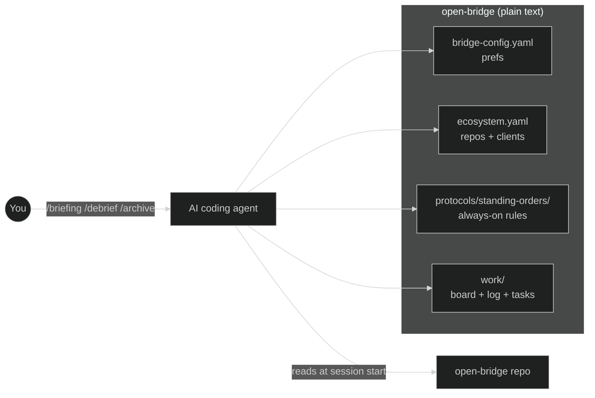

# open-bridge

open-bridge is a plain git repo of markdown and YAML your AI coding agent reads at the start of every session — so it already knows your repos, your clients, and how you work, independent of which model or frontend you run. No database, no SaaS, no second app to maintain.

> **Status:** Public, MIT (with a separate trademark policy). Built at BKS-Lab and used to run it — one self-hosted instance, no external users yet. This README documents the method and substrate, not adoption.

[](LICENSE)
[](TRADEMARK.md)
[](CONTRIBUTING.md#developer-certificate-of-origin-dco)
[](https://github.com/bks-lab/open-bridge/actions/workflows/validate.yml)
[](https://github.com/bks-lab/open-bridge/releases)

---

## The problem

Most people's AI work is a bare My-Documents folder — every conversation rebuilds context and structure from scratch:

- "I switch between clients and load the wrong context."
- "I have no record of what I decided last week."
- "My agent forgets which conventions apply where."
- "Every session, I re-explain who I am and what I'm working on."

The fix isn't a smarter prompt. It's giving the agent a place to remember.

---

## What it is — the substrate

Everything in open-bridge is plain text: markdown and YAML in a git repo, read at session start. The substrate itself runs nothing — no database, no daemon, no SaaS, no hosted service. It's just files your agent reads. There's nothing to host and no second app to maintain.

That choice is the whole point:

> **Agents can read a file but can't hold an API key.** What you write into open-bridge today, your agent still reads in six months — no migration, no second app, no vendor lock-in.

Because the substrate is inspectable text, you don't have to trust a black box. Clone the repo and `cat` any file your agent reads. Diff it. Version it. The agent's "memory" is just files you own.

---

## Two properties this substrate enables

These are the two named claims the project is built around. Both were coined at BKS-Lab; the plain-English meaning leads, the coined term follows.

### Context Booster

Whatever model and frontend you use, open-bridge adds an independent layer of context the agent always reads — a "third side" beside your model and your tool. The project/ecosystem registry ([`ecosystem.example.yaml`](ecosystem.example.yaml) — your live `ecosystem.yaml` is generated at onboarding) plus always-on standing orders give the agent persistent, structured knowledge of your world: who you are, your repos and clients, what you worked on yesterday. So it stops asking "GitHub or Jira?", stops loading the wrong client, and you can just say *"good morning, briefing"* and get what matters today.

It works across Claude Code, Codex, and Copilot CLI through a single `skills/` tree — because plain text is something every agent runtime can read.

> *Coined at BKS-Lab as the "Context Booster" — the most important purpose of open-bridge.*

### KI-Chaos-Bändiger (AI-chaos tamer)

Most people's AI work looks like that bare My-Documents folder — everyone piles up their own chaos, and every new conversation starts over. open-bridge tames that by shipping **example structures**, so you don't have to invent your own filing system. The concrete instance is the **Task-Management system** — a board, a daily log, and per-task status (`backlog` → `doing` → `review` → `done`): finite tasks live in `work/tasks/`, long-running streams in `work/streams/`, closed work in `work/done/`. Unstructured sessions become a filed, persistent, compounding record.

> *Coined at BKS-Lab: "structuring unstructured AI dialogues."*

> **Design stance — roadmap (BET/OPEN).** The intended default is *workspace separation*: tasks kept separate per context, no information bleeding between engagements, with a general rule — *"if you can't place it into your known world-models, ask."* This is agreed in principle but **not yet built into open-bridge**, and the hard-silo-vs-soft-folder default is unresolved. See [What's proven, what's a bet, what's open](#whats-proven-whats-a-bet-whats-open). Do not read it as a shipped feature.

---

## Show, don't tell

A fresh clone starts mostly empty — the value compounds as you fill `work/log.md`. [`examples/agency/`](examples/agency/) ships a complete two-client *configuration* (identity, infra, workflow, standing orders) to clone and read. The `work/` tree below is the shape your own work gets filed into as you go:

```
your-bridge/
├── identity/                  WHO am I, to WHOM do I send
├── infra/                     WHERE runs what, HOW to reach it
├── workflow/                  WHAT happens when (contexts, projects)
└── work/
    ├── board.md               live task board
    ├── log.md                 daily work log
    ├── tasks/                 finite tasks
    │   ├── bigcorp-migration/STATUS.md      ← client A, isolated
    │   └── startupxyz-mvp/STATUS.md         ← client B, isolated
    ├── streams/               long-running streams (never "done")
    └── done/2026-06/          closed, archived monthly
```

A task `STATUS.md` and a `work/log.md` row are just text the agent reads and writes:

```markdown
# STATUS — bigcorp-migration
status: doing
context: bigcorp
last: Migrated the invoice pipeline to the new schema; one test still red.
next: Fix the failing UBL-validation case, then open the PR.
```

```markdown
| 14:22 | Decision | bigcorp | Pinned the schema to v2 — v3 breaks the old exports. |
```

That row is in the repo six months from now, in a diff, readable by any agent.

---

## Why not just a CLAUDE.md / my own folder?

A `CLAUDE.md` is one flat instruction sheet. open-bridge is a persistent, structured workspace that does three things a dotfile can't:

1. **It separates per-context worlds.** Each client/engagement gets its own workspace, so the agent doesn't load the wrong client's facts into this client's summary.
2. **It keeps a persistent work record across sessions** — a board, a log, and per-task status that survive when the conversation ends.
3. **It updates shared templates without ever clobbering your private data** — the CORE/USER split (below) merges upstream improvements in while your config stays yours.

The relief is that the structure is *shipped, not invented*: you get a clear, opinionated place for everything instead of reinventing your own My-Documents chaos.

**Not for** a single-repo project or ad-hoc one-off scripting — the coordination layer is overhead you won't use.

---

## What's proven, what's a bet, what's open

open-bridge is built and used at BKS-Lab to run BKS-Lab — a small team at BKS-Lab, self-used on one instance (N=1). It has zero external users today — it is newly public, not yet adopted. This README documents method and substrate, not a user base.

**PROVEN — built and self-used (N=1):**

- The three-cluster layout (`identity/` · `infra/` · `workflow/`), the Task-Management system (board, log, per-task STATUS), the CORE/USER branch split, personas, standing orders, and the skills layer all run from a fresh clone today.
- Scope-routing works in practice: each file carries a scope (`core` / `org` / `user`); `/promote` routes per scope — demonstrated, not theoretical.
- GitHub task sync works for our own use (the agent already knows whether a task also exists in GitHub and syncs it). Jira is untested.

**BET — falsifiable wagers:**

- Markdown + YAML + git is the substrate successive agent-runtime generations keep reading natively, because models read text, not a vendor API. *Falsified if* the dominant agent stack later forces a schema-vendor (e.g. Notion-MCP / Linear-MCP) as the standard.
- A lean, opinionated, MIT-OSS method beats a vendor workflow-builder for users who want to switch models freely. *Falsified if* Cursor/Anthropic ship a first-class markdown-in-git mode.
- Workspace separation as a hard default — once built — is the right call for most users, not an opt-in switch. (The default itself is still on the roadmap; see OPEN.)

**OPEN — unsolved:**

- Zero external users today — newly public, not yet adopted. Until real users arrive, every statement about a target audience is a hypothesis, not a market test.
- Workspace-separation-as-default, the "if you can't place it into your known world-models → ask" rule, and off-topic stripping of unrelated tangents are agreed in principle — off-topic stripping is hand-tested as a *separate* Bridge skill, but **none of these are built into open-bridge yet**; the hard-silo vs soft-folder default is unresolved.
- First-session value is thin: a fresh clone gives little reward until `work/log.md` is filled.
- Terminology cleanup is pending (`work-task` → Task-Management; the `work/` folder made unambiguous).
- The submodule architecture between open-bridge and a private org overlay is deferred and must be settled before the fork.

---

## How it works

### CORE/USER split — why the context compounds safely

open-bridge uses two branches that split your data from shared templates. Your accumulated context — tasks, config, agent definitions, credentials — lives on `user/{name}`. Shipped templates, skills, and docs live on CORE (`main`). The two touch different paths, so:

- **Merges never conflict** — pull upstream template updates anytime with `git merge main`.
- **Your data stays private** — credentials and client data never land on `main`.
- **Improvements flow back** — `/promote` reads each file's `scope:` and routes `scope: core` changes upstream as PRs.

The branch-model mermaid and the full promote-routing rules live in [`docs/structure.md`](docs/structure.md) and [`docs/extension-model.md`](docs/extension-model.md).

### Skills — the model-agnostic verbs

Skills are the verbs over the substrate. They live in one `skills/` tree, symlinked into the paths Claude Code, Codex, Copilot CLI, and Cursor each scan — so the same skill loads no matter which tool you run. Describe what you need in plain language ("draft the daily briefing", "process this transcript") and the matching skill loads itself. The point is the cross-tool agnosticism, not a number.

### Standing orders

Always-on rules in `protocols/standing-orders/` get injected into every agent dispatch's system prompt — code-style rules, security baselines, logging habits. They are the supporting mechanism behind the Context Booster: third-side rules that ride into every prompt, which a static `CLAUDE.md` can't do per-context.

### Sub-agents

open-bridge ships the pattern plus one reference sub-agent (`archivist`, for document intake); you add the rest by dropping another `.claude/agents/{name}.md` next to it — auto-discovered at session start. This is Claude Code-specific: under Copilot CLI, Codex, Gemini, or Cursor, skills run inline in the main session instead of an isolated sub-process, with no capability loss.

### A few commands

Commands are skills whose `description` declares a `/cmd` trigger. The handful that demonstrate the claim:

| Command | Action |
|---------|--------|
| `/bridge` | Status dashboard: ecosystem, agents, work |
| `/briefing` | Daily briefing: board, git activity, goals |
| `/debrief` | Turn a meeting transcript into filed tasks + a protocol |
| `/archive` | Archive the week + generate a summary |
| `/bridge-onboard` | New-user setup or reconfiguration |

---

## System Overview



Everything is plain text the agent reads at session start — no database, nothing to host.

---

## Safety & trust

open-bridge drives an AI agent over your repos, infra, and cloud — so the guardrails matter as much as the features. They are written into how the agent is instructed to behave (`AGENTS.md` / `CLAUDE.md`), and because the substrate is plain text you can read and change every one of them:

- **Propose, then confirm.** The agent proposes; you decide. Every persistent change to its own configuration goes through a human gate, and it pauses before writing into your productive folders.
- **Destructive and outward actions are gated per action.** Shutdown / reboot / delete, sending a message, merging a PR, rotating a credential — each needs an explicit `[y]`, never a blanket yes.
- **Secrets never live in the repo.** Only reference URIs (`azure-keyvault://…`, `1password://…`, `keychain://…`) — the real values stay in your vault, and CI fails on a committed secret.
- **Nothing phones home.** open-bridge is files your agent reads locally — no telemetry, no analytics, no hosted service. Nothing leaves your machine.
- **It's inspectable.** Clone the repo and `cat` exactly what the agent reads; its "memory" is a diffable git history you own.

These are conventions the agent follows, not an OS-level sandbox — read them in `AGENTS.md` and adapt them to your own risk tolerance.

---

## Get started

```bash
git clone https://github.com/bks-lab/open-bridge.git
cd open-bridge
./bin/setup          # macOS / Linux / WSL   —   Windows (PowerShell): ./bin/setup.ps1
/bridge-onboard      # run inside Claude Code
```

`./bin/setup` (or `bin/setup.ps1` on Windows) verifies the cross-tool discovery symlinks; `/bridge-onboard` walks ecosystem detection, work-system config, and your `user/{name}` branch.

**What's instant:** a running, empty workspace. **What's a bet:** the compounding value — that needs `work/log.md` filled with real work over time.

**Cross-tool reality:** tested with [Claude Code](https://claude.ai/code) (most complete — slash commands and hooks live under `.claude/`). Codex and Copilot CLI work via `AGENTS.md` plus the `skills/` symlink. Gemini CLI, Cursor, and Windsurf follow the same standard but are untested. Windows symlink mechanics and the `.agents/`/`.github/` discovery paths are covered in the layout table in [`docs/structure.md`](docs/structure.md).

See [`examples/agency/`](examples/agency/) for a complete two-client configuration to clone and read.

---

## Optional integrations (USER-scope, enable as needed)

open-bridge ships more than the four core pieces, but none of it is needed to get value, and it stays out of the hero on purpose. Each is a USER-scope capability you turn on when you want it; the code ships, the README just doesn't narrate it:

- **Channels** — outbound messaging transports (email, Telegram, Signal, iMessage, …): [`docs/channels.md`](docs/channels.md)
- **Remotes** — machine inventory, SSH, services, health checks: [`docs/remotes.md`](docs/remotes.md)
- **doc-system** — inbox scan, classify, route, file documents (another "ship example structures" instance): [`docs/doc-system.md`](docs/doc-system.md)
- **Personas** — self-identities with signatures and destination paths: [`docs/personas.md`](docs/personas.md)
- **Themes** — vocabulary layer; `professional` (en, default) and `professional-de` are runtime toggles, not a reason to bilingualize this README: [`rules/theme.md`](rules/theme.md)
- **Agent Identity** — the orchestrator's own `SOUL.md` / `IDENTITY.md` voice and posture: [`identity/agent/README.md`](identity/agent/README.md)
- **GitHub / ADO Projects** — advisory integration via the `project-advisor` skill, gated in `bridge-config.yaml`: [`trackers/README.md`](trackers/README.md)

The full layout map — every path and the CORE/USER split — lives in [`docs/structure.md`](docs/structure.md). How open-bridge relates to a private org overlay — the CORE/USER/overlay tier model — is in [`docs/extension-model.md`](docs/extension-model.md).

---

## Contributing

See [`CONTRIBUTING.md`](CONTRIBUTING.md). Short version:

1. Fork and clone `bks-lab/open-bridge`.
2. Create your `user/{name}` branch.
3. Build something on CORE (docs, commands, skills, templates).
4. Run `/contribute` — it scans your branch, runs the mandatory content-safety gate, and opens a fork-based PR against `bks-lab/open-bridge` with a DCO sign-off (`git commit -s`) for you.

Routing by `scope:`: `scope: core` belongs upstream — anyone can PR it here. `scope: org` content goes to your own shared overlay repo, if you maintain one. `scope: user` stays local on your branch and is never pushed upstream.

---

## License & trademark

open-bridge is released under the **MIT License** — code and content alike, so there is a single, unambiguous reuse path. A **separate trademark policy** governs the project name, brand, and logo, because licenses cover copyright, not brands.

| Layer | Covers | Terms | File |
|---|---|---|---|
| Code & content | Everything in this repository | MIT | [LICENSE](LICENSE) |
| Brand | `open-bridge`, project name and logo | Trademark policy | [TRADEMARK.md](TRADEMARK.md) |

MIT is the deliberate choice: it keeps reuse frictionless while the separate trademark policy protects BKS-Lab's brand for commercial offerings built on the same architecture.

**Copyright (c) 2026 BKS-Lab (Boiman Kupermann Solutions GmbH) and Contributors.**

Contributions are accepted under the MIT License and require a [Developer Certificate of Origin](https://developercertificate.org/) sign-off (`git commit -s`); CI enforces it. This is community open-source software, provided as-is and without warranty.

---

## Acknowledgments

open-bridge draws on a large body of public work — agent-orchestration patterns, the propose-then-confirm posture, the identity/voice split, config-as-data conventions. A non-exhaustive list of named inspirations, plus the inspiration-is-not-endorsement note, lives in [ACKNOWLEDGMENTS.md](ACKNOWLEDGMENTS.md).

---

## Try it

open-bridge is **public and MIT** — there's no waitlist and nothing to sign up for. Clone it, read it, run it. It's newly released with no external users yet, so expect rough edges and tell us where they are.

- **Read the code on GitHub:** [`bks-lab/open-bridge`](https://github.com/bks-lab/open-bridge)
- **See a complete example:** [`examples/agency/`](examples/agency/)
- **Found a rough edge?** Open an issue — that's the most useful thing you can do right now.
