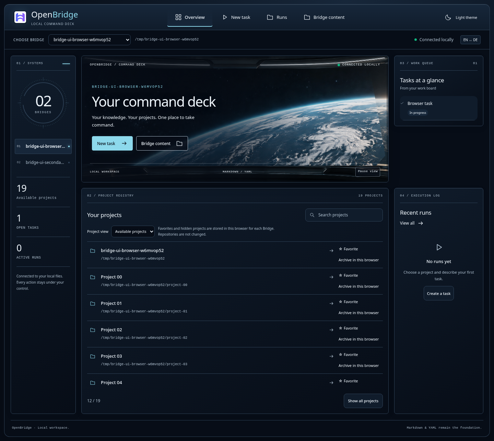

# Local Bridge UI



The optional React/TypeScript interface reads the existing Bridge project registry
and Markdown task files through a local Python service. It does not replace YAML,
Markdown or Git with a second application database. Run metadata and output are
operational state under `.bridge/ui/`, outside version control.

## Build and start

Initial supported platform: Linux (process identity and cancellation use Linux
facilities). Requirements: Python 3.10+, PyYAML, Git, Node.js 22.12+ with npm for
the frontend build, and an installed/authenticated Codex or Mistral Vibe CLI to
start model-backed runs. Viewing the workspace does not require either CLI.

```bash
cd ui
npm ci
npm run build
cd ..
./bin/open-bridge-ui --bridge-root /path/to/your/private/bridge
```

Open `http://127.0.0.1:8792`. Use `--port` to choose another local port. The
application code and Bridge data directory can be separate checkouts; select
existing private instance data with `--bridge-root`. No data migration is required.
The service binds to loopback only and serves the built frontend from `ui/dist/`.
It is a local single-user application, not a public hosting or multi-user service.
Model-backed runs may contact the selected CLI provider; local UI does not mean
offline inference.

## Workflow

1. Select a project from the existing ecosystem registry and choose an available
   client. Only existing project directories are listed; unavailable clients are disabled.
2. Enter an explicit task. Inspection is the default; editing is a separate mode.
   Vibe repository trust is opt-in. The service never adds automatic approval.
3. Start once and follow the persisted run. Reloading a browser only reads status;
   it does not restart the job. A request identifier makes retries idempotent.
4. Read output, errors and the current Git changes. Cancel an active run when
   needed. Server restart can reconnect to independently running workers.
5. Review changes before using your existing CLI/contribution workflow to publish.
   This first version does not automatically commit, push, create PRs or merge.

The Git view describes current project state, including any changes that existed
before the run. A successful process exit is not a code-review or publication
approval. The existing pre-publication checks remain necessary.

## Choose a Bridge

Use the **Bridge** selector in the header to choose a registered local Bridge.
The full path identifies the current instance. The catalog contains the startup
Bridge, valid Bridge roots from its ecosystem and instance registry, and optional
explicit roots supplied with repeatable `--browse-root /path/to/another/bridge`.
A candidate must contain `AGENTS.md` and `scripts/bridge-config.py`; arbitrary
browser-supplied filesystem paths are not accepted.

All selected Bridges support editing eligible existing files. Only the startup
Bridge exposes CLI runs and run history. To run an agent in another instance,
start its own UI service with that instance as `--bridge-root`. Files, backups
and edit logs stay in the selected instance; they are never copied into the
startup Bridge. Merely browsing does not create state in a secondary instance.

Selection belongs to the browser tab. Every request carries the selected Bridge
identifier; switching clears the previous view and pending task form. Separate
tabs can view different Bridges without changing each other's active instance.

## Browse Bridge contents

Open **Bridge contents** to browse the local instance itself: work and archived
work, knowledge, skills, rules, protocols, identity, infrastructure, workflow,
documentation and root configuration files. Search by path or choose a category,
then open a file to read its current contents. The viewer displays source text,
including Markdown and YAML; embedded HTML and scripts are not executed.

The overview is a preview. Full project and task lists are available without
having to know a name to search for. Registered project paths remain execution
targets; their separate repository contents are not mirrored into this browser.

The content browser excludes credentials, hidden operational/cache directories,
vendor trees, binary files and symbolic links. It never follows a link outside
the selected Bridge. Large text files show an explicit truncation notice rather
than silently appearing complete. The source files remain authoritative; this
view does not create an application database.

## Edit files

Open a file and choose **Edit file**, make the change, then **Save file**.
The editor supports existing UTF-8 text files up to 256 KiB. Truncated previews,
symbolic links, hard-linked files and excluded credential artifacts cannot be
saved. YAML, JSON and Markdown YAML frontmatter receive syntax validation before
writing; this is not a full Bridge schema or semantic validator.

Saving checks the version you opened. If the file has changed, the service
returns a conflict and your draft stays in the editor. **Reload file** explicitly
discards the draft after confirmation. Closing the file, changing view/Bridge or
reloading the page warns about unsaved changes. An expired service session can
be reconnected without discarding the draft; saving remains explicit.

The previous bytes are backed up under `.bridge/ui/backups/` in that same Bridge.
The success message identifies the backup. Open **Backups**, select **Load as draft**,
review the difference, then save to restore it. Loading a backup never writes the
file. Saving uses the same revision check and creates a backup of the replaced
version. Up to 50 recent backups per file are listed.
The new file is written atomically with its mode preserved. GUI writes are
serialized and versions are rechecked immediately before replacement. External
programs need not honor the GUI lock; a backup preserves the opened version.
Work-log or directory-durability problems after a completed replacement are
reported as warnings alongside a successful save, not as an unsaved-file error.

The editor does not create a Git commit or push changes. Review and publication
remain separate actions.

## Brand and languages

The OpenBridge mark, wordmark and bilingual interface follow the repository's
existing design tokens. English/German labels, categories, editor feedback and
dates are localized; source filenames and document contents remain unchanged.
The logo and its generation record are described in [UI brand](ui-brand.md).

## Architecture and boundaries

- `ui/`: optional browser client; locale theme vocabulary is separate from logic.
- `scripts/bridge-ui.py` and `bin/open-bridge-ui`: service entry points.
- `scripts/lib/ui_service.py`: project/task discovery, HTTP contracts and persistent
  run management. Client execution reuses shared process handling and work-log completion checks.
- Browser requests use a same-origin cookie and CSRF token. Host validation rejects
  unrelated hostnames. The service does not expose a generic shell or filesystem API.
- Project roots are resolved from the declared registry; request bodies cannot
  supply arbitrary execution directories or commands.
- Workers persist results independently. Cancellation checks process identity,
  and disappeared workers are marked interrupted rather than successful.
- Prompts and CLI output may contain private project information. Their local run
  directory is private state and must not be published with the application source.

Each output stream retains at most 16 MiB; the browser reads at most the last
256 KiB of retained output. These bounds keep large runs from exhausting memory.
Cancellation and worker-death cleanup cover ordinary descendants in the owned
process group; this is not an OS sandbox against a deliberately escaping program.

The CLI remains usable without installing or running this interface. Existing
Markdown/YAML files continue to be edited through the established Bridge workflow.

## Verification

```bash
python3 -m unittest discover -s scripts/tests -p 'test_ui_service.py'
cd ui
npm ci
npm run build
npx playwright install chromium
cd ..
python3 scripts/tests/test_ui_browser.py
```

Regression tests use deterministic fake clients and temporary repositories rather
than paid model calls. Browser verification covers submission, polling, reload,
results, cancellation, error states, content navigation and responsive layout
against the real service.


## Flight deck workspace

The default visual treatment is a restrained cinematic command deck: deep navy
panels, readable instrument text and ice-blue focus accents from `DESIGN.md`.
A light theme remains available. The interface uses real project, task and run
state; it does not invent telemetry. English and German are selectable at runtime.

The overview initially lists available, non-archived projects. Registry
`archived: true` or `status: archived | retired | deprecated` entries are excluded
from that view. Favorites and per-project archive overrides are stored only in
this browser, separately for each Bridge; they do not archive a GitHub repository.
Use the project-view selector to reveal all entries or the archive. Unavailable
and archived projects are excluded from the new-task selector.

In Bridge content, enable **Search file contents** and submit at least two
characters to search file text and paths. Results include the first matching
line. The scan excludes ineligible files, files above 256 KiB and files exceeding
a 32 MiB scan budget; skipped files are explicitly counted. It is a bounded local
search, not an external index. Recently opened paths stay in the local browser.

Markdown opens in a reading view with tables and task lists. Raw HTML and embedded
images are not rendered; external HTTP(S) links open separately. Source view
highlights common code/configuration formats up to 60,000 characters; larger
sources remain readable as plain text. Relative Markdown links are currently
plain text. While editing, **Review changes** shows additions and removals before
saving. Ctrl/Command + Enter saves with the same checks as the Save button.
Editor actions remain above the text and stick while scrolling. Backup loading
locks concurrent edits and navigation until the draft is ready.

The main bundle loads the editor on demand. Keyboard focus, a skip link,
reduced-motion support and mobile layout are included. Automated accessibility
checks supplement browser interaction tests; they do not establish universal
usability or a complete accessibility certification.


### Spatial command console

The overview now uses a horizontal navigation gantry and three coordinated
instrument areas: registered Bridge stations and real counts on the left, a
panoramic forward display plus compact project register in the center, and
existing tasks/runs on the right. Station buttons switch the same selected Bridge
as the dropdown; they never start a CLI job. At tablet widths the work panels
move below the center, and on phones all panels stack with ordinary controls.

`ui/src/command-console.css` owns this presentation separately from editor and
runtime styles. The decorative viewport plate is shipped locally as
`ui/public/bridge-panorama.png`; it contains no live data. Every text label,
button, task and project above it is rendered by React. Image provenance and the
exact generation prompt are recorded in [UI brand](ui-brand.md).


The planet view drifts slowly on a separate layer over a 100-second alternating
cycle; the structural frame and all controls remain stationary. Pause/resume is
available in the window footer and persists in this browser. The operating
system's reduced-motion preference disables the decorative animation. This is
an animated image plate, not a physical planet/weather simulation.
